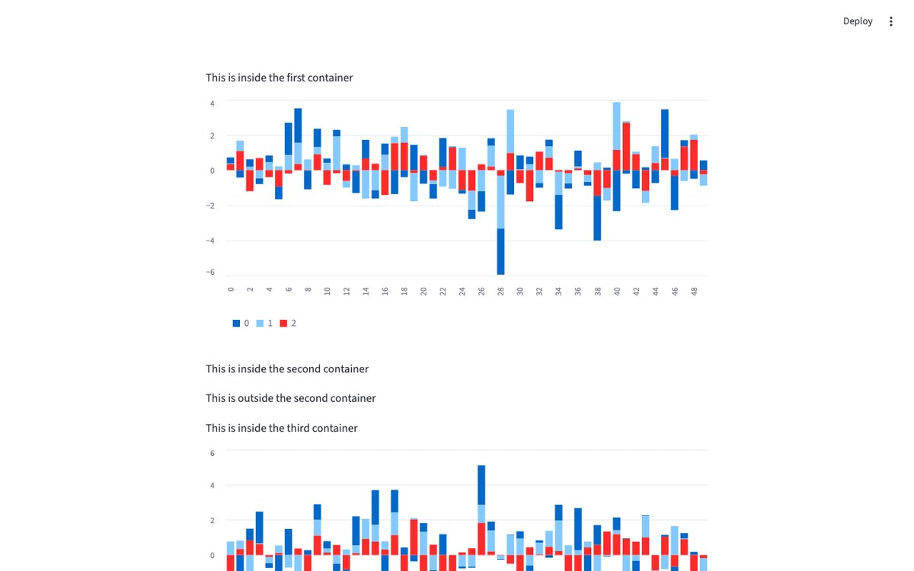

<div align="center">

# streamlit_container

**`st.container`로 화면 요소를 묶고 배치하는 방법을 보여 주는 Streamlit 예제**




</div>

## 내용

`streamlit_app.py` 한 파일에 예제 세 개가 들어 있습니다.

| 예제 | 보여 주는 것 |
|---|---|
| 예제 1 | `with st.container():` 블록 안에 텍스트와 `st.bar_chart`(난수 50×3) 배치 |
| 예제 2 | `container = st.container()`로 객체를 만든 뒤 `container.write()`로 요소 추가, 컨테이너 바깥 요소와 비교 |
| 예제 3 | 예제 1과 같은 구성을 한 번 더 두어 컨테이너 단위로 화면이 나뉘는 모습 확인 |

같은 구성(`st.container` 예시 1~3)이 [『Streamlit 가이드북: 데이터 시각화부터 웹 배포까지』](https://github.com/Streamlit-Guide-Web-App-Development/guidance2streamlit) 6장 예제 코드([`chap_06.py`](https://github.com/Streamlit-Guide-Web-App-Development/guidance2streamlit/blob/main/chap_06/chap_06.py))에도 실려 있습니다.

## 실행

```bash
pip install -r requirements.txt
streamlit run streamlit_app.py
```

## 기술 스택

- Python, Streamlit (`st.container`, `st.bar_chart`)
- NumPy (예제용 난수 데이터)

---

<div align="center">
<sub>Made by <a href="https://github.com/khwee2000">김민수 (@khwee2000)</a></sub>
</div>
